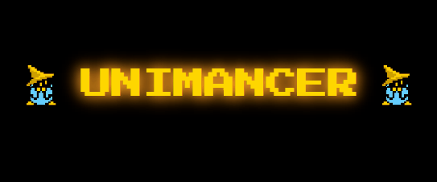
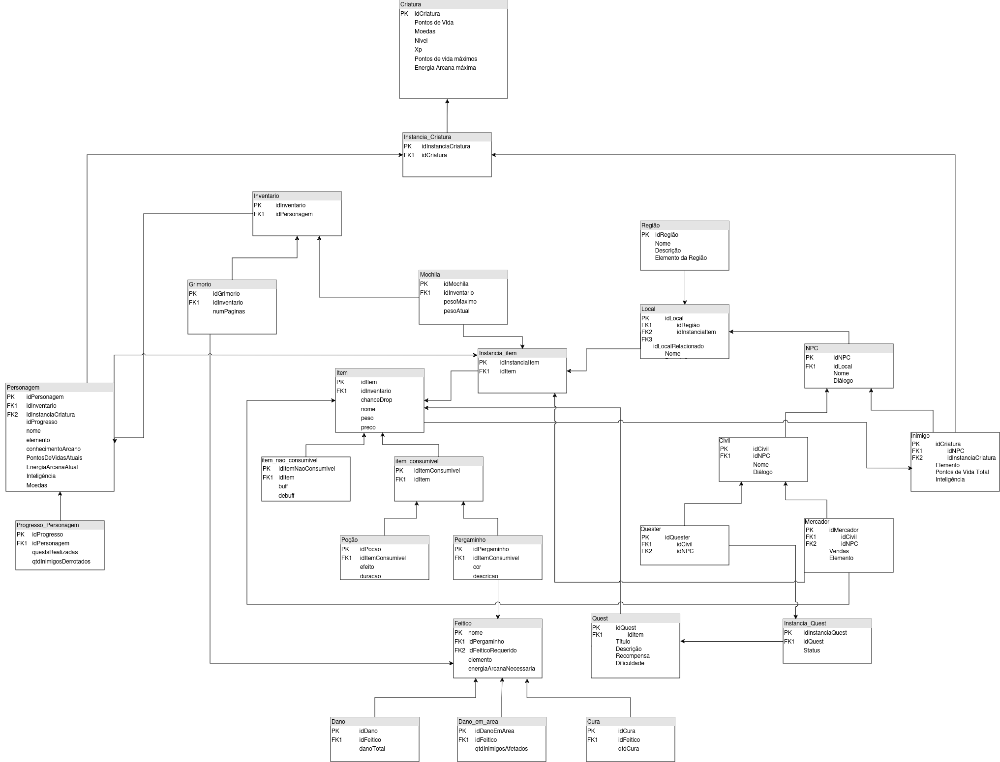

## Alunos

| Matrícula  | Aluno                                  | Usuário                                               | Foto de Perfil                                      |
| ---------- | -------------------------------------- | ---------------------------------------------------- | -------------------------------------------------- |
| 22/1022604 | João Victor da Silva Batista de Farias | [@beyondmagic](https://github.com/beyondmagic)       |  |
| 20/2046283 | Millena de Abreu Queiroz               | [@MillenaQueiroz](https://github.com/MillenaQueiroz) |  |
| 22/2006169 | Natan da Cruz Almeida                  | [@natanalmeida03](https://github.com/natanalmeida03) |  |
| 22/1022408 | Paulo Henrique Lamounier Dantas        | [@Nanashii76](https://github.com/Nanashii76)         |  |
| 22/1031363 | Renan Vieira Guedes                    | [@R-enanVieira](https://github.com/R-enanVieira)     |  |

## Sobre 

Unimancer é um jogo estilo **MUD (Multi-User Dungeon)**, offline e baseado em texto. Mergulhe em um universo mágico onde você controla magos em busca de poder, conhecimento e aventuras.

Há eras, o equilíbrio entre os elementos sustentava o mundo de **Arcanae**. Os **Unimancers** são magos que dominam apenas um desses elementos, dedicando sua vida ao estudo, criação de novas magias e desvendar runas antigas, cada mestre mago era guardião de seu conhecimento, e assim, um equilíbrio de manteve por muitos anos. Com o tempo, um antigo mago chamado **Nosferus** se cansou dessa fragmentação de conhecimento, e partiu para uma jornada em busca de pergaminhos de todos os elementos, deixados em dungeons pelo antigos magos lendários. Segundo as lendas, no monte da **Floresta do Abismo**, seus conhecimentos estão escondidos, porém, muitos tentaram, mas nunca conseguiram chegar perto.

Magos especializados em um único elemento caminham pelo mundo. Sua missão é simples, mas perigosa: recuperar a sabedoria perdida, conquistar sua própria árvore de habilidades e restaurar ~~(ou corromper)~~ o equilíbrio dos elementos.

[**Dicionário de dados**](https://sbd1.github.io/2024.2-unimancer/modelagem/dd/)

## Apresentações

1. [Entrega de DER, MER, MR e DD](https://youtu.be/rYFDGP1GFUo).

## Screenshots

**Diagrama de Entidade-Relacionamento**

**Modelo Relacionamento**

## Instalação

**Tecnologia:** PostgreSQL;

**Modelo do Banco:** [draw.io](https://drive.google.com/file/d/14wc0GC0F9QGjhKfZOi1-kghpwYJfIDvr/view?usp=drive_link);

Descreva os pré-requisitos para rodar o seu projeto e os comandos necessários.

## Uso 
Explique como usar seu projeto caso haja algum passo a passo após o comando de execução.

## Outros
### **Mecânicas do Jogo**

#### **Criação de Personagem**

- Personalize seu personagem escolhendo seu nome e especialização mágica.
- Escolha entre os quatro elementos disponíveis:
    - **Água**: Magias de cura e manipulação de fluxo.
    - **Fogo**: Magias destrutivas e agressivas.
    - **Terra**: Defesa e resistência inigualáveis.
    - **Vento**: Velocidade e controle estratégico.

---

#### **Progressão**

- Explore um grafo de habilidades único, desbloqueando magias avançadas ao encontrar **grimórios mágicos** e completar **quests**.
- Resolva desafios em **dungeons** para ganhar **conhecimento arcano** e pontos de habilidade.

---

#### **Combate Estratégico**

- Sistema de combate **turn-based** com foco em buffs, debuffs e exploração de fraquezas elementais.
- Cada inimigo tem um elemento próprio que pode ser explorado para vantagem estratégica.

---

#### **Exploração e Descoberta**

- Viaje por regiões mágicas, cada uma oferecendo buffs ou debuffs baseados na sua especialização.
- Áreas podem estar bloqueadas até que certas condições sejam atendidas.

---

#### **NPCs e Quests**

- Interaja com NPCs que oferecem quests e lore adicionais.
- Complete tarefas para desbloquear recompensas, como equipamentos raros e dicas sobre novas áreas.

---

#### **Sistema de Inventário**

- Gerencie um inventário limitado, organizando itens importantes como pergaminhos, poções e armas mágicas.
- Recursos escassos incentivam escolhas estratégicas.

---

#### **Salvar e Continuar**

- Progresso salvo automaticamente ao descansar em áreas seguras ou concluir tarefas importantes.
