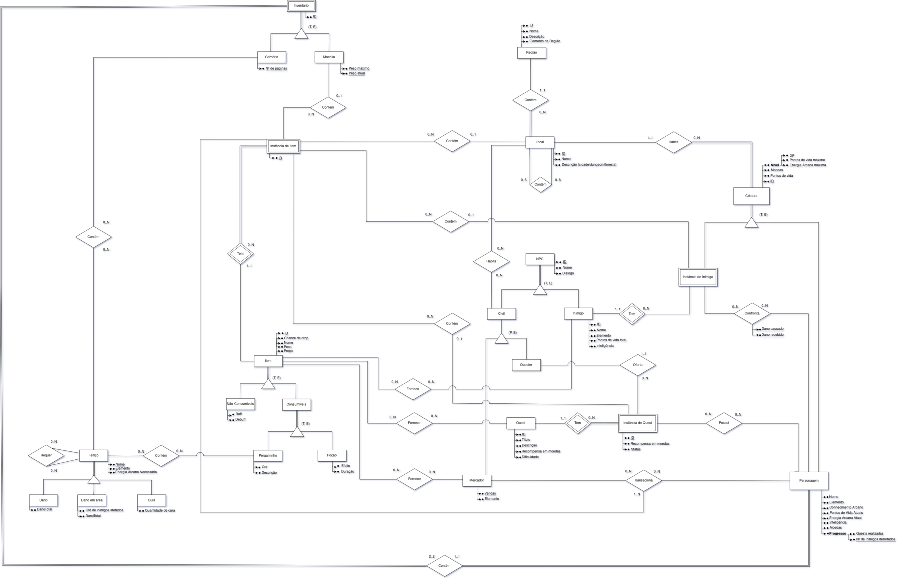

# Diagrama Entidade-Relacionamento - DER

## Introdução
O Diagrama Entidade-Relacionamento (DER) é formado por elementos gráficos que representam os componentes do modelo Entidade-Relacionamento, como entidades, atributos, chaves, relacionamentos e restrições estruturais. Ele oferece uma visão lógica do banco de dados, apresentando uma estrutura geral e simplificada de como os dados de um sistema estão organizados.

### Versão 1.0

<figcaption>Diagrama Entidade-Relacionamento</figcaption>

### Versão 1.1

<figcaption>Diagrama Entidade-Relacionamento</figcaption>

### Versão 2.0

<figcaption>Diagrama Entidade-Relacionamento</figcaption>

<iframe frameborder="0" style="width:100%;height:550px;" src="https://viewer.diagrams.net/?tags=%7B%7D&lightbox=1&highlight=0000ff&edit=_blank&layers=1&nav=1&title=C%C3%B3pia%20do%20Modelo%20do%20Banco#Uhttps%3A%2F%2Fdrive.google.com%2Fuc%3Fid%3D1LmqFYalKUFanMXNyoyCjIa3fUyVEtV8_%26export%3Ddownload"></iframe>

## Histórico de Versão

| Versão |     Data   | Descrição | Autor |
| :----: | :--------: | :-------: | :---: |
| `1.0`  | 28/10/2024 | Criação   | Grupo |
| `2.0`  | 22/11/2024 | Adicionado na documentação   | Grupo |
| `2.1`  | 25/11/2024 | Atualiação   | Grupo |
| `2.2`  | 12/01/2025 | Atualização   | Grupo |