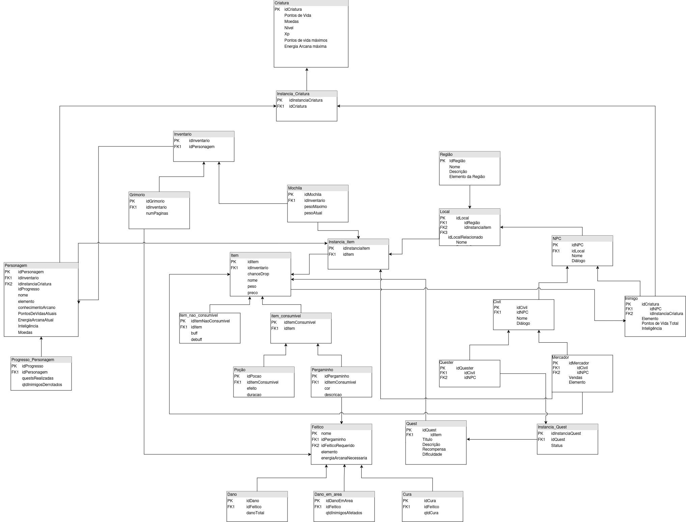

# Modelo Relacional - MR

## Introdução
O Modelo Relacional (MR) é uma forma de organizar dados em bancos de dados, que armazena e fornece acesso a dados relacionados entre si.

## MREL

### Versão 1.0

<figcaption>Modelo Relacional</figcaption>

### Versão 2.0 

<figcaption>Modelo Relacional</figcaption>

<iframe frameborder="0" style="width:100%;height:600px;" src="https://viewer.diagrams.net/?tags=%7B%7D&lightbox=1&highlight=0000ff&edit=_blank&layers=1&nav=1&title=MER%203.0.drawio#Uhttps%3A%2F%2Fdrive.google.com%2Fuc%3Fid%3D1MMESJaBbnvHBPD98ipvpOgKT2eiZ-Qj-%26export%3Ddownload"></iframe>

### Versão 3.0

<figcaption>Modelo Relacional</figcaption>

<iframe frameborder="0" style="width:100%;height:600px;" src="<iframe frameborder="0" style="width:100%;height:1450px;" src="https://viewer.diagrams.net/?tags=%7B%7D&lightbox=1&highlight=0000ff&edit=_blank&layers=1&nav=1&title=MR%204.0.drawio#Uhttps%3A%2F%2Fdrive.google.com%2Fuc%3Fid%3D1pwDS_7oYXVxzyN4hE3IEnMRV8j6W4QfA%26export%3Ddownload"></iframe>"></iframe>

### Versão 4.5

<figcaption>Modelo Relacional</figcaption>

<iframe frameborder="0" style="width:100%;height:1450px;" src="https://viewer.diagrams.net/?tags=%7B%7D&lightbox=1&highlight=0000ff&edit=_blank&layers=1&nav=1&title=MREL%204.5.drawio#Uhttps%3A%2F%2Fdrive.google.com%2Fuc%3Fid%3D1pwDS_7oYXVxzyN4hE3IEnMRV8j6W4QfA%26export%3Ddownload"></iframe>

## Histórico de Versão

| Versão |     Data   | Descrição | Autor |
| :----: | :--------: | :-------: | :---: |
| `1.0`  | 24/11/2024 | Criação   | Grupo |
| `2.0`  | 27/12/2024 | Criação   | Grupo |
| `2.1`  | 05/01/2025 | Criação   | Grupo |
| `3.0`  | 12/01/2025 | Atualização   | Grupo |
| `4.0`  | 21/01/2025 | Atualização   | Grupo |
| `4.5`  | 03/02/2025 | Atualização   | Grupo |
